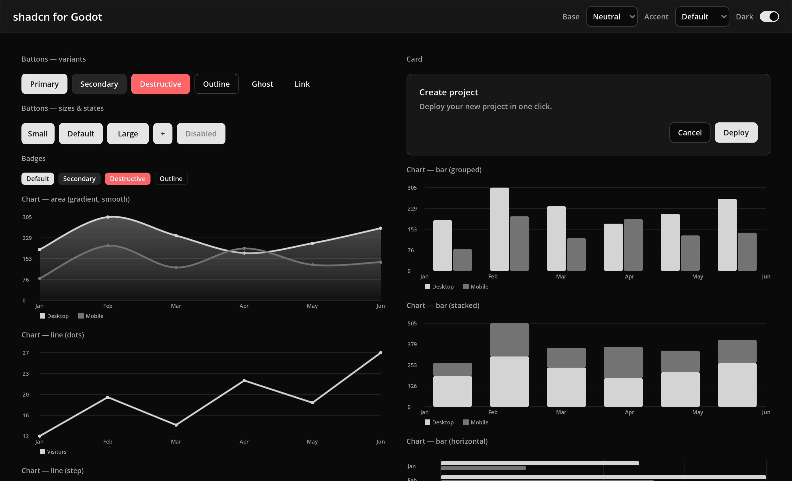
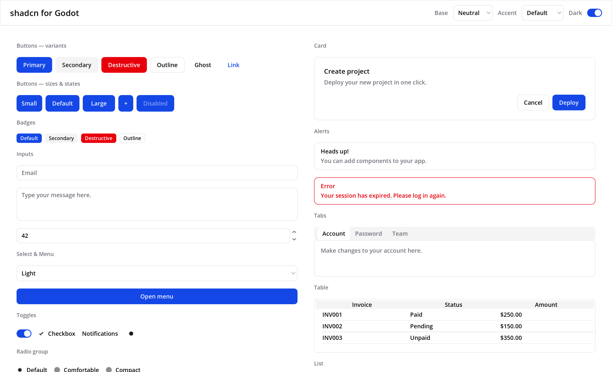

# shadcn-godot

A [shadcn/ui](https://ui.shadcn.com) look-and-feel for Godot 4 — a drop-in
**Theme** that restyles every stock control, plus the UI **components Godot
doesn't ship** (charts, dialogs, calendar, command palette, data table, toasts
and more), each styled to match.

**[📖 Documentation](https://atticusofsparta.github.io/godot-addon-shadcn/)** ·
**[▶ Live demo](https://atticusofsparta.github.io/godot-addon-shadcn/docs/live-example)**
(the example exported to the web)



Colors are the shadcn **neutral** base, taken from the shadcn/ui v4 source
(`apps/v4/app/globals.css`) and converted from OKLCH to sRGB (Godot themes are
sRGB). Light and dark variants are included.

## Requirements

Godot **4.3+** (developed and verified against 4.6.3).

## Install

1. Copy the `addons/shadcn/` folder into your project's `addons/` directory.
2. Enable **shadcn-godot** in *Project → Project Settings → Plugins*.

Enabling the plugin registers a convenience autoload, `ShadcnToasts`. Every
component also declares a `class_name`, so it shows up in the editor's
*Create New Node* dialog and is usable from code even with the plugin disabled.

## Using the theme

Apply a theme to any `Control` (set it on your root control to theme the whole
UI). Pre-generated `.tres` themes ship for every shadcn **base color** in light
and dark, e.g.:

- `res://addons/shadcn/themes/shadcn_neutral_dark.tres`
- `res://addons/shadcn/themes/shadcn_zinc_light.tres`
- …`stone`, `mauve`, `olive`, `mist`, `taupe` (× `_light` / `_dark`)
- `shadcn_dark.tres` / `shadcn_light.tres` — neutral, kept as default names

The theme styles `Button`, `LineEdit`, `TextEdit`, `OptionButton`,
`PopupMenu`, `PanelContainer`/`Panel`, `TabContainer`/`TabBar`, `ProgressBar`,
`HSlider`/`VSlider`, scrollbars, `Tree`/`ItemList`, `CheckBox`/`CheckButton`,
`Label`, tooltips, separators and more. A stock `Button` looks like the shadcn
**primary** button by default.

## Color schemes

shadcn uses two color axes, both supported here:

- **Base color** — `neutral`, `stone`, `zinc`, `mauve`, `olive`, `mist`, `taupe`
  (defines the full grayscale + tint).
- **Accent color** — `blue`, `green`, `rose`, `violet`, … (overrides the primary
  / secondary). `""` keeps the base color's own primary.

Switch the **whole UI** — theme *and* custom components — at runtime:

```gdscript
# (root_control, base, accent, dark)
ShadcnTokens.apply($Root, "zinc", "blue", false)   # zinc + blue accent, light
ShadcnTokens.apply($Root, "neutral", "", true)     # default neutral, dark
```

`apply()` rebuilds the theme via `ShadcnTheme.build()`, assigns it to the
Control, and tells every shadcn component (group `shadcn_refresh`) to restyle.
You can also build a theme directly:

```gdscript
$Root.theme = ShadcnTheme.build("stone", "emerald", true)
```

The example scene has a live Base / Accent / Light-Dark selector in its toolbar.



## Components

The custom nodes (under `addons/shadcn/components/`):

| Node | Base | Notes |
|------|------|-------|
| `ShadcnButton` | `Button` | `variant` (Primary/Secondary/Destructive/Outline/Ghost/Link) + `button_size` (Default/SM/LG/Icon) |
| `ShadcnBadge` | `Label` | `variant` (Default/Secondary/Destructive/Outline) |
| `ShadcnCard` | `PanelContainer` | bordered surface; `elevated` adds a shadow |
| `ShadcnCardTitle` / `ShadcnCardDescription` | `Label` | heading + muted text for a card |
| `ShadcnSwitch` | `BaseButton` | animated pill toggle; emits `switched(on)` |
| `ShadcnAlert` | `PanelContainer` | `title` + `description`, Default/Destructive |
| `ShadcnAvatar` | `Control` | circular `image` with initials `fallback` |
| `ShadcnSkeleton` | `Control` | pulsing loading placeholder |
| `ShadcnSpinner` | `Control` | indeterminate rotating arc |
| `ShadcnAccordionItem` | `VBoxContainer` | collapsible `title` + `body` |
| `ShadcnBreadcrumb` | `HBoxContainer` | crumbs from `items`; emits `crumb_pressed(i)` |
| `ShadcnChart` | `Control` | line / area / bar / pie / donut / radar / radial; options: `curve` (linear/step/smooth), `horizontal`, `stacked`, `gradient`, `show_dots`, `show_values`; animates in; hover data tooltip; uses chart-1..5 |
| `ShadcnTooltip` | `Node` | hover tooltip that opens above the trigger (set `side`); add as a child of any Control |
| `ShadcnToast` | `CanvasLayer` | toast stack (shadcn Sonner) |
| `ShadcnKbd` | `Label` | keyboard key cap |
| `ShadcnToggle` | `Button` | two-state toggle; on = accent fill |
| `ShadcnToggleGroup` | `HBoxContainer` | row of toggles; `single` for radio behavior |
| `ShadcnButtonGroup` | `HBoxContainer` | joins buttons with a shared border |
| `ShadcnInputGroup` | `PanelContainer` | input with `add_prefix`/`add_suffix` addons; `line_edit` |
| `ShadcnInputOTP` | `HBoxContainer` | one-time-code boxes; emits `completed(code)` |
| `ShadcnPagination` | `HBoxContainer` | page nav; emits `page_changed(page)` |
| `ShadcnEmpty` | `VBoxContainer` | empty state (icon/title/description + `actions`) |
| `ShadcnItem` | `PanelContainer` | media + title + description + `actions` |
| `ShadcnField` | `VBoxContainer` | label + `content` slot + helper/error text |
| `ShadcnSidebar` | `PanelContainer` | collapsible side panel; `content` slot |
| `ShadcnDialog` | `CanvasLayer` | modal dialog; `body`/`footer`; `open()`/`close()` |
| `ShadcnAlertDialog` | `ShadcnDialog` | confirm dialog; emits `confirmed`/`canceled` |
| `ShadcnSheet` | `CanvasLayer` | slide-out panel (set `side`) |
| `ShadcnDrawer` | `ShadcnSheet` | bottom drawer |
| `ShadcnHoverCard` | `Node` | rich `body` shown on hover, above the trigger |
| `ShadcnCalendar` | `PanelContainer` | month grid; emits `date_selected(y,m,d)` |
| `ShadcnDatePicker` | `Button` | button opening a calendar popover |
| `ShadcnCombobox` | `Button` | searchable select; emits `selected(value)` |
| `ShadcnCommand` | `PanelContainer` | command palette (search + `add_item`) |
| `ShadcnCarousel` | `Control` | pager; `add_slide`, prev/next, dots |
| `ShadcnDataTable` | `VBoxContainer` | filter + sortable table (`set_columns`/`add_row`) |

### Examples

```gdscript
# Button variants
var b := ShadcnButton.new()
b.variant = ShadcnButton.Variant.DESTRUCTIVE
b.text = "Delete"
add_child(b)

# Toast from anywhere (auto-creates a layer)
ShadcnToast.notify(self, "Event created", "Sunday, June 15 at 9:00 AM.")

# ...or via the autoload installed by the plugin
ShadcnToasts.push("Saved", "Your changes were saved.")

# Charts. shadcn's gallery (area gradient, bar horizontal/stacked, line
# step/dots, radar, radial, ...) is reachable by combining kind + options
# rather than dozens of separate types. Colored by the palette's chart-1..5,
# animates in, and shows a hover tooltip for inspecting data points.
var chart := ShadcnChart.new()
chart.kind = ShadcnChart.Kind.AREA
chart.curve = ShadcnChart.CurveType.SMOOTH   # or STEP / LINEAR
chart.gradient = true                        # fade the area fill
chart.x_labels = ["Jan", "Feb", "Mar", "Apr", "May", "Jun"]
chart.add_series([186, 305, 237, 173, 209, 264], "Desktop")
chart.add_series([80, 200, 120, 190, 130, 140], "Mobile")
add_child(chart)

# Same node, different looks:
#   chart.kind = ShadcnChart.Kind.BAR; chart.horizontal = true; chart.stacked = true
#   chart.kind = ShadcnChart.Kind.RADAR
#   chart.kind = ShadcnChart.Kind.RADIAL

# Tooltip that opens above any control (shadcn default side)
var tip := ShadcnTooltip.new()
tip.text = "Add to library"
my_button.add_child(tip)
```

Open `examples/showcase.tscn` for a live gallery of everything.

## Stock control → shadcn mapping

Godot already covers many shadcn components once themed:

| shadcn | Godot control |
|--------|---------------|
| Button | `Button` (+ `ShadcnButton` for variants) |
| Input | `LineEdit` |
| Textarea | `TextEdit` |
| Select / native-select | `OptionButton` |
| Dropdown / Context menu | `PopupMenu` |
| Checkbox | `CheckBox` |
| Tabs | `TabContainer` / `TabBar` |
| Progress | `ProgressBar` |
| Slider | `HSlider` / `VSlider` |
| Dialog | `AcceptDialog` / `ConfirmationDialog` |
| Separator | `HSeparator` / `VSeparator` |
| Table / List | `Tree` / `ItemList` |
| Tooltip | built-in tooltips (`tooltip_text`) |

The components in this addon fill the gaps shadcn provides that Godot does not.

## How the colors are generated

Everything traces back to the shadcn/ui source (vendored at `tools/themes.ts`):

```bash
# 1. Parse themes.ts -> addons/shadcn/palettes.gd (OKLCH converted to sRGB).
python3 tools/generate_palettes.py

# 2. Re-export the shipped .tres themes from the GDScript builder.
godot --headless --path . --script res://tools/export_themes.gd
```

`addons/shadcn/theme_builder.gd` (`ShadcnTheme`) is the single source of truth
for the *look*; `palettes.gd` is the single source of truth for the *colors*.
The shipped `.tres` files are just a pre-export of `ShadcnTheme.build()` so the
addon works without any code. `tools/oklch.py` holds the OKLCH→sRGB math.

## License

The shadcn/ui design tokens originate from the
[shadcn/ui](https://github.com/shadcn-ui/ui) project (MIT). This addon's code
is provided under the MIT License.
